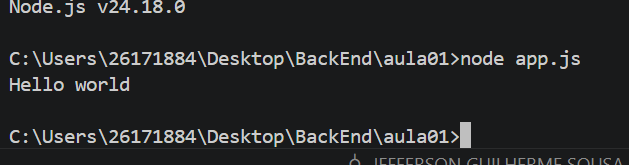

# meu primeiro projeto JavaScript
## Aluno💀
Nome: jefferson
Turma: DS1A
Professor: Vitor Lima
_
Este projeto foi desenvolvido durante a primeira aula de JS
O objetivo foi aprender:
- utilizar o VS code 
- executar o javascript com node.js
- utilizar o terminal
- Criar documento utilizando Markdown

_

## Estruturas
...
MeuPrimeiroProjetoJS
|
|-app.js
|-informacoes.js
|-operadores.js
|-variavel.js
|-readme.md
|-imagem/

...

## Como executar

bash
    node app.js

## Código 
javascript
    console.log("Olá mundo")

## Resultado 

## Tecnologia
- JavaScript;
- Node.js;
- VisualStudio Code;
- MarkDown;

## O que aprendi
- Criar arquivos em JavaScript;
- Executar programas;
- Utilizar o MarkDown;
- GIT;
- Variável;
- operadores;